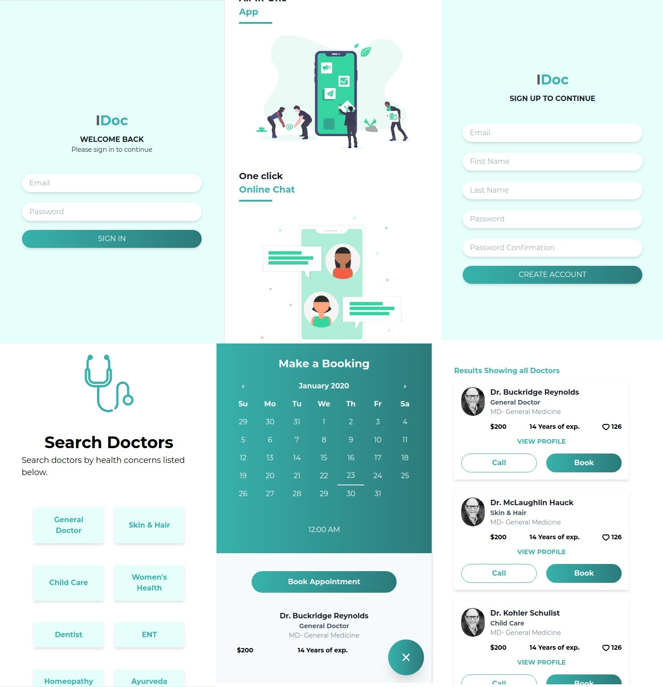

# Edoc



## Introduction
This is part of two part project in [Microverse](https://www.microverse.org/) curriculum
The project handle searching physicians by their speciality and handles creating appointments with patients.

It uses back-end api built with rails
rails API [edoc-api](https://github.com/mosaaleb/edoc-api/)

**Features**
- Authentication with JWT
- Filtering physicians by category
- Creating appointments with physicians
- Mobile app

## Built With
- TailwindCSS
- React
- Redux
- React router

## Live Demo

[Live Demo Link](https://livedemo.com)

### Prerequisites
- create-react-app
- yarn or npm

### Setup
```
git clone git@github.com:mosaaleb/edoc.git
cd edoc
yarn install
```

**Server**
`yarn react-scripts start`

### Deployment

## Author

👤 **Author1**

- Github: [@githubhandle](https://github.com/mosaaleb)
- Twitter: [@twitterhandle](https://twitter.com/muhammadebeid)
- Linkedin: [linkedin](https://www.linkedin.com/in/muhammadebeid/)

## 🤝 Contributing

Contributions, issues and feature requests are welcome!

Feel free to check the [issues page](issues/).

## Acknowledgments
- [UI](https://www.behance.net/gallery/77208667/MediCo-Medical-mobile-app-UIUX-design?tracking_source=search%7Cmobile%20app) Inspiration

## 📝 License
This project is [MIT](lic.url) licensed.